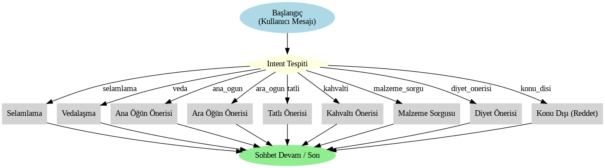
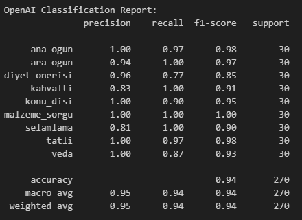
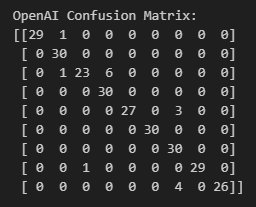
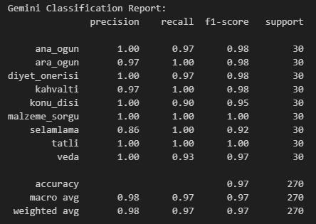
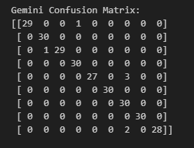
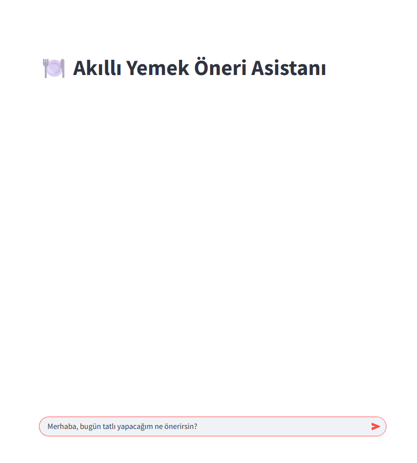
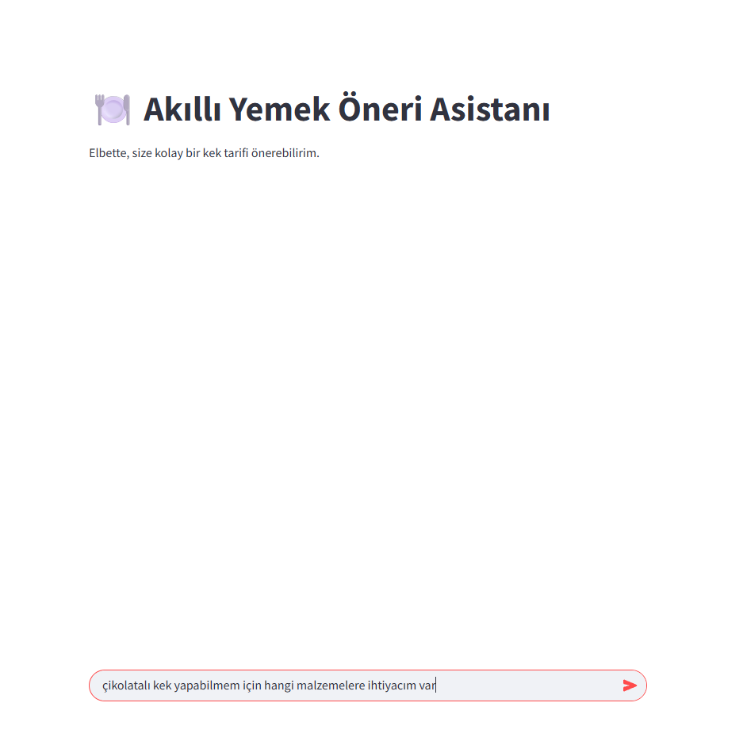
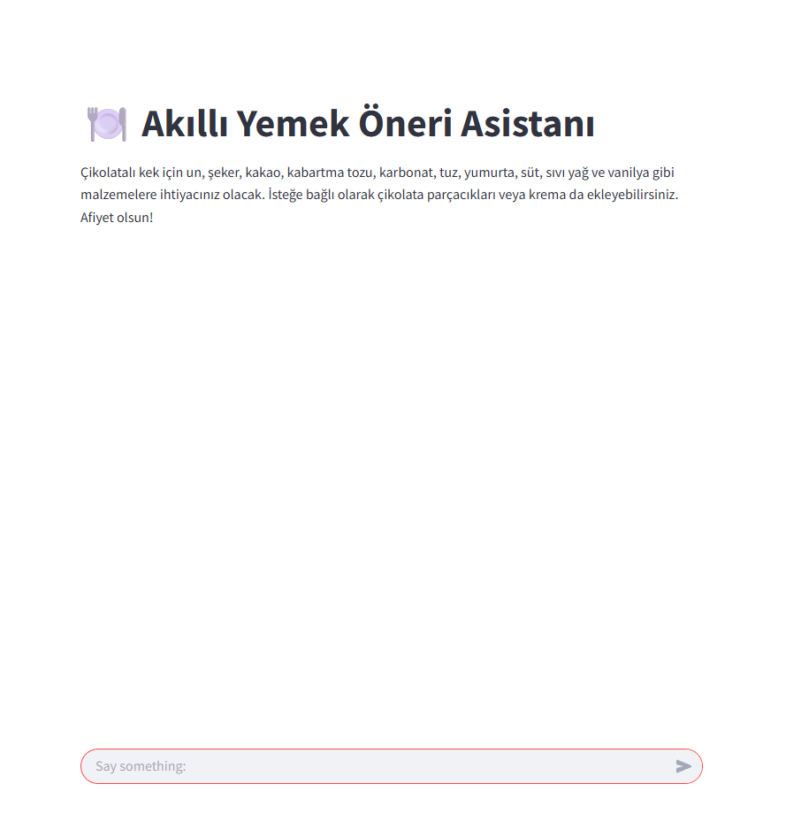
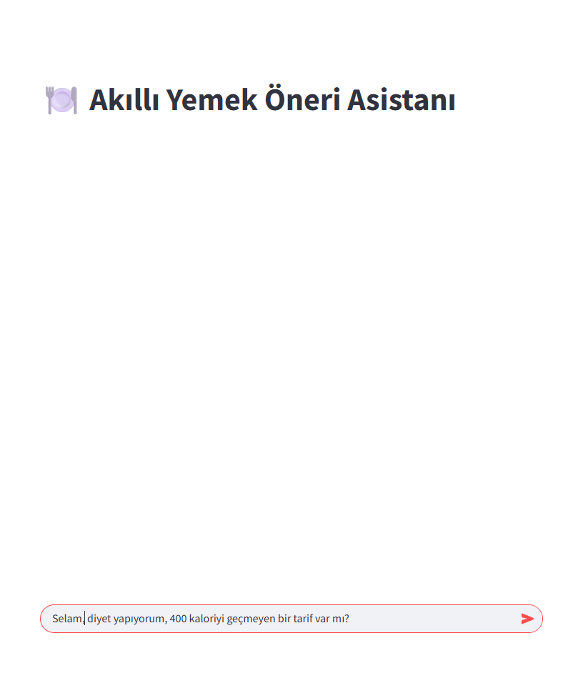
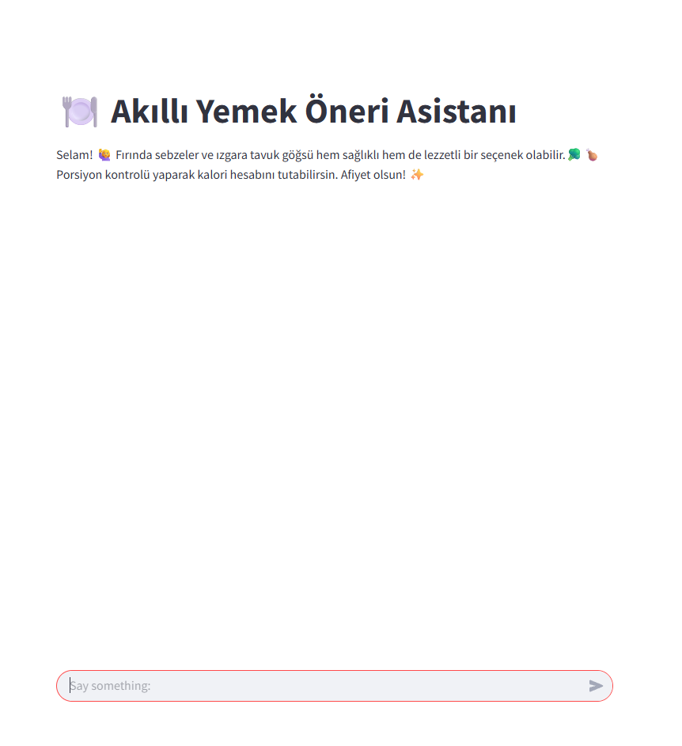

# 🍽️ Akıllı Yemek Öneri Chatbot Projesi

Bu proje, yemek önerileri alanında geliştirilmiş bir intent tabanlı yapay zekâ destekli chatbot uygulamasıdır. Chatbot, kullanıcıdan gelen metinleri önceden tanımlanmış **intent** türlerine göre sınıflandırır ve ilgili cevapları üretir. Projede iki farklı LLM (Large Language Model) olan **OpenAI GPT** ve **Google Gemini** modelleriyle sınıflandırma işlemleri gerçekleştirilmiş, sonuçlar karşılaştırılmıştır.

---

## Proje Sahibi
- **Adı Soyadı:** Makbule Berber
- **Okul:** Yıldız Teknik Üniversitesi  
- **Bölüm:** Endüstri Mühendisliği  
- **Dönem:** Bahar 2025

---

## 🎯 Proje Amacı

Seçilen bir konuya özgü chatbot geliştirmek.

Geniş bir veri seti oluşturmak ve niyet sınıflandırması yapmak.

İki farklı LLM modeli (GPT & Gemini) ile sınıflandırma sonuçlarını karşılaştırmak.

Elde edilen sınıflandırma performanslarını ölçmek (Precision, Recall, F1 Score).

Chatbot'u kullanıcıyla etkileşimli bir şekilde sunmak (Streamlit arayüzü ile).

## 👥 Hedef Kitle
Son kullanıcılar: Ne pişireceğine karar veremeyen bireyler, diyet yapanlar veya tatlı tarifi arayanlar.

Yapay Zeka / NLP öğrencileri: Chatbot geliştirme, intent sınıflandırma ve model karşılaştırma üzerine örnek proje arayan öğrenciler.

Ürün geliştiriciler: Konuşma tabanlı yemek uygulamaları, dijital asistanlar ve tarif platformları geliştiren ekipler.

## 💡 Kullanılan Yöntemler
Niyet (intent) sınıflandırma: Kullanıcı girdileri 9 farklı niyet sınıfında sınıflandırıldı (örneğin: ana_ogun, tatli, veda).

Veri seti: 1350 satırlık özel olarak etiketlenmiş, Türkçe yemek odaklı intent verisi kullanıldı.

Modeller: OpenAI GPT-4 Turbo ve Google Gemini 2.0 flash modelleri, aynı test verisiyle karşılaştırmalı olarak test edildi.

Model kullanımı: Modeller hazır API üzerinden inferans amaçlı kullanıldı.

Veri bölünmesi: Veri, %80 eğitim ve %20 test seti olarak ayrıldı.

Metrikler: Precision, Recall, F1-Score gibi temel sınıflandırma metrikleri kullanılarak detaylı değerlendirme yapıldı.

Confusion Matrix: Her modelin sınıflandırma hataları görselleştirildi.

## Chatbot Akış Tasarımı

Chatbot, aşağıdaki intent’lere uygun olarak cevap üretebilmektedir:

| Intent Türü     | Açıklama                     | Örnek Cümle                      |
| --------------- | ---------------------------- | -------------------------------- |
| `selamlama`     | Karşılama                    | Merhaba, nasılsınız?             |
| `veda`          | Vedalaşma                    | Görüşürüz, kendinize iyi bakın   |
| `ana_ogun`      | Ana öğün önerisi             | Bugün akşam ne yesem?            |
| `ara_ogun`      | Atıştırmalık önerisi         | Ara öğün için ne önerirsin?      |
| `tatli`         | Tatlı seçeneği               | Tatlı bir şeyler arıyorum        |
| `kahvalti`      | Kahvaltı önerisi             | Sabah kahvaltısında ne yemeli?   |
| `malzeme_sorgu` | Tarif içeriği sorgulama      | Bu yemekte hangi malzemeler var? |
| `diyet_onerisi` | Düşük kalorili besin önerisi | Kalorisiz bir şey önerir misin?  |
| `konu_disi`     | Alakasız içerik              | Film önerisi verir misin?        |

<h2>🧾 Akış Diyagramı</h2>

  

Kullanıcı mesajı intent sınıflandırıcısı tarafından sınıflandırılır, uygun intent’e göre cevap seçilir, kullanıcıya sunulur.

---

## 🗃️ Veri Seti

Toplam **1350 satırdan** oluşan veri seti oluşturulmuştur. Her satır, bir intent türü ve bu intent'e karşılık gelen örnek kullanıcı cümlesini içermektedir.

**Format:** `CSV`

📌 Python'dan yararlanılarak örnek intent ve cümle kalıpları verilerek veri üretimi sağlanmıştır.

**Örnek:**

| Intent           | Örnek Cümle                             |
|------------------|-----------------------------------------|
| selamlama        | Merhaba, nasılsınız?                    |
| diyet_onerisi    | Az kalorili yemek önerisi var mı?       |
| tatli            | Şekerli bir şeyler yemek istiyorum.     |

📂 [Veri seti dosyasına gitmek için tıklayın](01_gemini/yemek_chatbot_veriseti.csv)

---

## 🤖 Kullanılan LLM Modelleri

### 1. 🔷 Google Gemini
Model: Gemini 2.0 Flash

Kullanım Yöntemi: Google Generative Language API

Entegrasyon Aracı: google.generativeai Python kütüphanesi

Erişim: API Anahtarı ile Google AI Studio üzerinden sağlanmıştır.

Kapsam: Kullanıcının yemekle ilgili sorduğu sorular üzerinden niyeti belirlenmiş ve bu doğrultuda cevaplar Gemini tarafından oluşturulmuştur.

### 2. 🔶 OpenAI
Model: GPT-4o

Kullanım Yöntemi: OpenAI API

Entegrasyon Aracı: openai Python kütüphanesi

Erişim: OpenAI hesabı üzerinden alınan API anahtarı ile gerçekleştirilmiştir.

Kapsam: GPT modeli, oluşturulan intent tabanlı veri kümesinden gelen kullanıcı girdilerine uygun olarak önerilerde bulunmuştur.

### 🛠 Neden Bu Modeller Seçildi?
Gemini 2.0 Flash, Google'ın hızlı ve hafif modeli olarak düşük gecikmeyle yanıt verebilme avantajı sağlamaktadır. Kullanıcı niyetini hızlı şekilde analiz ederek temel düzeyde etkili cevaplar üretmektedir.

GPT-4o, OpenAI'nin en yeni ve güçlü modeli olup çoklu modalite (görsel, sesli, metin) desteği ile birlikte yüksek doğruluk oranına sahiptir. Karmaşık niyetleri ve cümle yapılarını daha başarılı analiz edebilmektedir.

Bu iki model, farklı mimari yapılarına ve cevap üretim stratejilerine sahip olduklarından dolayı karşılaştırmalı değerlendirme için tercih edilmiştir.

### 📦 Gerekli Kütüphaneler: 
Her iki LLM için gerekli tüm bağımlılıklar [requirements.txt](requirements.txt) dosyasında listelenmiştir.

---

## 📊 Model Performans Karşılaştırması

Proje kapsamında kullanılan veri seti, %80 eğitim ve %20 test olarak ayrılmıştır. Bu işlem Python ortamında programatik olarak gerçekleştirilmiştir.

[train_dataset.csv](01_gemini/train_dataset.scv) ve [test_dataset.csv](01_gemini/test_dataset.csv) dosyaları Gemini ve GPT modelleri için ilgili klasörlerde ayrı ayrı konumlandırılmıştır.

Sadece test verisi kullanılarak modellerin yanıt performansı değerlendirilmiştir. [performance_gemini.ipynb](01_gemini/performance_gemini.ipynb) ve [performance.openai.ipynb](02_openai/performance_openai.ipynb) klasörlerinde performans ölçümleri yapılmıştır.

Değerlendirme süreci her iki model için aynı test girdileriyle gerçekleştirilerek adil bir karşılaştırma sağlanmıştır.

# 🎯 Değerlendirme Metrikleri:

Precision (Kesinlik) : Modelin belirli bir sınıfa ait olduğunu tahmin ettiği örneklerin ne kadarının gerçekten o sınıfa ait olduğunu gösterir.

Recall (Duyarlılık) : Gerçekten belirli bir sınıfa ait olan örneklerin ne kadarını doğru şekilde bulduğunu gösterir.

F1 Score : Precision ve Recall’un harmonik ortalamasıdır. Dengeli bir genel başarı ölçüsüdür.

Confusion Matrix : Gerçek ve tahmin edilen sınıflar arasındaki karışıklığı tabloyla gösterir.
→ Satırlar gerçek sınıfları, sütunlar modelin tahmin ettiği sınıfları temsil eder. 

## OpenAI Classification Report:

📈 Değerlendirme Metriklerinin Yorumlanması
Modelin başarımı, Precision, Recall ve F1-Score metrikleri üzerinden detaylı olarak analiz edilmiştir. Aşağıda, her sınıf için bu metrikler özetlenmiş ve genel başarıya katkıları yorumlanmıştır:

<h2>🧾 Classification Report </h2>

  

### 📌 Gözlemler:
diyet_onerisi sınıfı, recall değerinin düşük olması nedeniyle modelin bu sınıfa ait örnekleri tanımakta zorlandığını göstermektedir (bazılarını başka sınıflara atamış).

kahvalti ve selamlama sınıflarında recall yüksek, ancak precision görece düşüktür. Bu da modelin bazı örnekleri bu sınıflara fazladan atadığını gösterir.

veda sınıfında recall düşüklüğü, modelin bazı gerçek veda örneklerini başka sınıflara atadığına işaret eder.

### 📊 Genel Başarı:
Accuracy (Doğruluk): %94

Macro Avg: Precision: 0.95, Recall: 0.94, F1-Score: 0.94

Weighted Avg: Dataların destek (support) sayılarına göre ağırlıklı ortalaması da aynı düzeyde yüksek çıkmıştır.

Bu sonuçlar, modelin genel olarak başarılı bir sınıflandırma performansı sunduğunu, ancak bazı sınıflarda veri çeşitliliği ve ayırt edicilik açısından geliştirilebileceğini göstermektedir.

## OpenAI Confusion Matrix:

OpenAI GPT modeline ait sınıflandırma sonuçları, aşağıda verilen confusion matrix ile detaylı olarak incelenmiştir. Matrisin satırları gerçek sınıf etiketlerini, sütunları ise modelin tahmin ettiği sınıfları temsil etmektedir.

<h2> Confusion Matrix </h2>

  

### 🔍 Öne Çıkan Gözlemler:
ara_ogun, kahvalti, malzeme_sorgu ve selamlama sınıflarında %100 başarı elde edilmiştir.

diyet_onerisi sınıfında yalnızca 23/30 doğru tahmin yapılmıştır. Bu sınıf, modelin en çok karıştırdığı kategori olmuştur. 6 örnek kahvalti, 1 örnek ise ara_ogun sınıfı ile karıştırılmıştır.

veda sınıfına ait 4 örnek, yanlışlıkla selamlama olarak sınıflandırılmıştır. Bu durum, günlük dilde bu iki niyetin benzer ifadelerle ifade edilmesinden kaynaklanabilir (örn. “Görüşürüz, kendine iyi bak”).

konu_disi niyeti ile selamlama arasında da bir miktar karışıklık görülmüştür.

## Gemini Classification Report:

📈 Model Performansının Değerlendirilmesi
Gemini modeli, test veri seti üzerinde yüksek doğruluk ve istikrarlı sınıflandırma sonuçları sunmuştur. Precision, Recall ve F1-Score metrikleri baz alınarak yapılan değerlendirme aşağıdaki gibidir:

  
  

### 🔍 Metriklerin Yorumu:
Precision: Gemini modelinin tahmin ettiği sınıfların büyük kısmı doğru çıktı. Özellikle tatli, malzeme_sorgu ve kahvalti sınıflarında %100 başarı sağlandı.

Recall: Modelin sınıfları tanıma başarısı genellikle yüksekti. selamlama ve veda sınıflarında bazı örnekler başka sınıflarla karışmıştır.

F1-Score: Tüm sınıflarda 0.92–1.00 arasında f1 değerleri elde edilmiştir.

### 📌 Dikkat Çeken Bulgular:
🔹malzeme_sorgu ve tatli sınıfları hem precision hem recall açısından mükemmel sonuçlar verdi.

🔹konu_disi sınıfında birkaç örnek selamlama olarak yanlış sınıflandırılmıştır.

🔹veda sınıfındaki birkaç örnek de selamlama ile karışmıştır, bu da niyetler arası semantik benzerlikten kaynaklanabilir.

### 📊 Genel Başarı:
Accuracy (Doğruluk): %97

Macro Avg F1-Score: 0.97

Weighted Avg F1-Score: 0.97

Modelin genel başarımı oldukça yüksek olup, sınıflar arasında dengeli bir performans sunmaktadır.

### ⚖️ GPT-4o ve Gemini Karşılaştırması

| Özellik             | GPT-4o         | Gemini         |
|---------------------|----------------|----------------|
| Genel Doğruluk      | %94            | %97            |
| Macro Avg F1-Score  | 0.94           | 0.97           |
| Selamlama Performansı | Daha yüksek    | Biraz düşük    |
| Konu Dışı Ayırımı   | Daha net       | Biraz karışıklık |
| Genel Kararlılık    | Yüksek         | Yüksek         |

GPT-4o, selamlama ve konu_disi gibi niyeti ayırt etmenin zor olduğu durumlarda daha dengeli bir yanıt verirken,

Gemini, malzeme_sorgu, tatli ve kahvalti gibi daha açık ve içerik bazlı sınıflarda çok yüksek başarı sağladığı görülmektedir.

---

## 🖥️ Streamlit ile Chatbot Arayüzü

Uygulama, **Streamlit** ile geliştirilmiştir. Kullanıcı, metin kutusuna mesaj yazar ve chatbot yanıt verir.

**Ana akış:** Kullanıcı mesajı → Model → Yanıt

### 🔹 Gemini Chatbot Arayüzü

    

### 🔹 OpenAI GPT Chatbot Arayüzü

   

